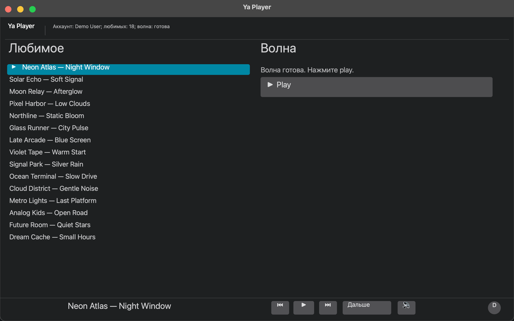

# Ya Music RC

Легкий нативный плеер для Яндекс Музыки на macOS. Приложение работает без встроенного браузера и WebView, поэтому потребляет меньше памяти, чем обычная вкладка браузера или Electron-оболочка.



На скриншоте показаны демонстрационные треки и демо-аккаунт.

## Что умеет

- Воспроизводит любимые треки из Яндекс Музыки.
- Запускает «Волну» и автоматически добирает следующие треки.
- Поддерживает media keys macOS: play/pause, следующий и предыдущий трек.
- Работает глобально, даже когда окно приложения не в фокусе.
- Ставит музыку на паузу при смене системного аудиовывода, например после снятия наушников.
- Имеет локальную громкость приложения, не меняющую системную громкость macOS.
- Хранит OAuth-токен только локально на компьютере.

## Как установить

1. Откройте раздел `Releases` в репозитории.
2. Скачайте файл `Ya-Player.dmg` из последнего релиза.
3. Откройте скачанный DMG.
4. Перетащите `Ya Player.app` в папку `Applications`.

После этого приложение будет лежать здесь:

```text
/Applications/Ya Player.app
```

## Первый запуск на macOS

Сборка пока подписана ad-hoc подписью, без Apple Developer ID notarization. Поэтому macOS может показать окно:

```text
Apple не удалось подтвердить, что файл не содержит вредоносного ПО
```

Если появилось такое окно, нажмите `Готово`, не перемещайте приложение в корзину.

Затем откройте Terminal и выполните:

```bash
xattr -dr com.apple.quarantine "/Applications/Ya Player.app"
open "/Applications/Ya Player.app"
```

Альтернативный способ без Terminal:

1. Откройте Finder.
2. Перейдите в `Applications`.
3. Нажмите правой кнопкой на `Ya Player`.
4. Выберите `Open` / `Открыть`.
5. Подтвердите запуск еще раз.

## Как войти

1. Запустите `Ya Player`.
2. Нажмите `Войти через Яндекс`.
3. Авторизуйтесь в браузере.
4. Если macOS спросит разрешение на управление браузером, разрешите доступ. Это нужно, чтобы приложение смогло прочитать redirect URL и забрать OAuth token.

Если автоматический вход не сработал, можно вставить в поле токена полный redirect URL или сам token и нажать `Проверить вход`.

Поддерживаемые варианты:

```text
AQAAA...
OAuth AQAAA...
https://music.yandex.ru/#access_token=AQAAA...&token_type=bearer
```

## Где лежат настройки

Токен и настройки сохраняются локально:

```text
~/Library/Application Support/YaMusicRc/ya-player/config.json
```

Файл нельзя публиковать, отправлять в чат или коммитить в репозиторий.

## Как пользоваться

- `Любимое` открывает список любимых треков.
- `Волна` запускает персональную волну.
- Нижняя панель управляет текущим треком, режимом воспроизведения, громкостью и аккаунтом.
- Кнопка аккаунта в правом нижнем углу открывает меню смены аккаунта.
- Кнопка громкости меняет только громкость приложения.

## Обновление

1. Скачайте новый `Ya-Player.dmg` из `Releases`.
2. Откройте DMG.
3. Перетащите новую версию `Ya Player.app` в `Applications`.
4. Подтвердите замену старой версии.

Если macOS снова заблокирует запуск, повторите команду:

```bash
xattr -dr com.apple.quarantine "/Applications/Ya Player.app"
open "/Applications/Ya Player.app"
```

## Ограничения

У Яндекс Музыки нет стабильного публичного desktop-client API для такого сценария. Приложение использует неофициальные endpoints, поэтому отдельные функции могут сломаться после изменений на стороне сервиса.

Для запуска без предупреждений Gatekeeper нужна полноценная Apple Developer ID подпись и notarization.
